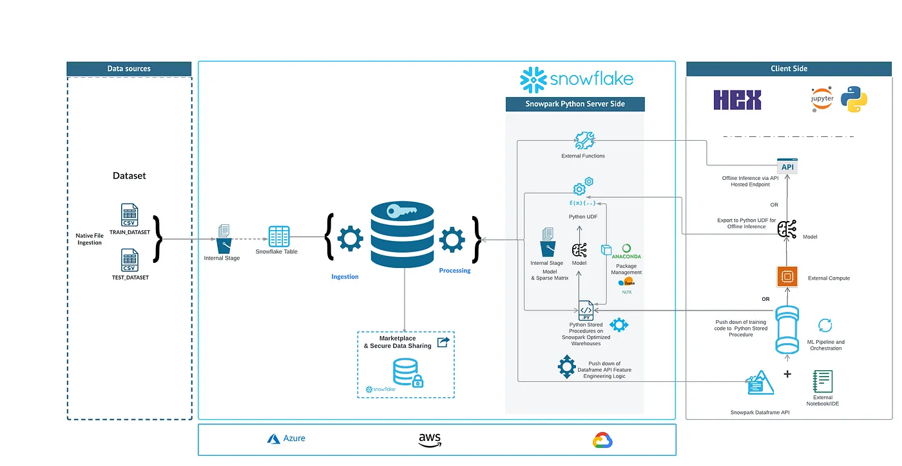
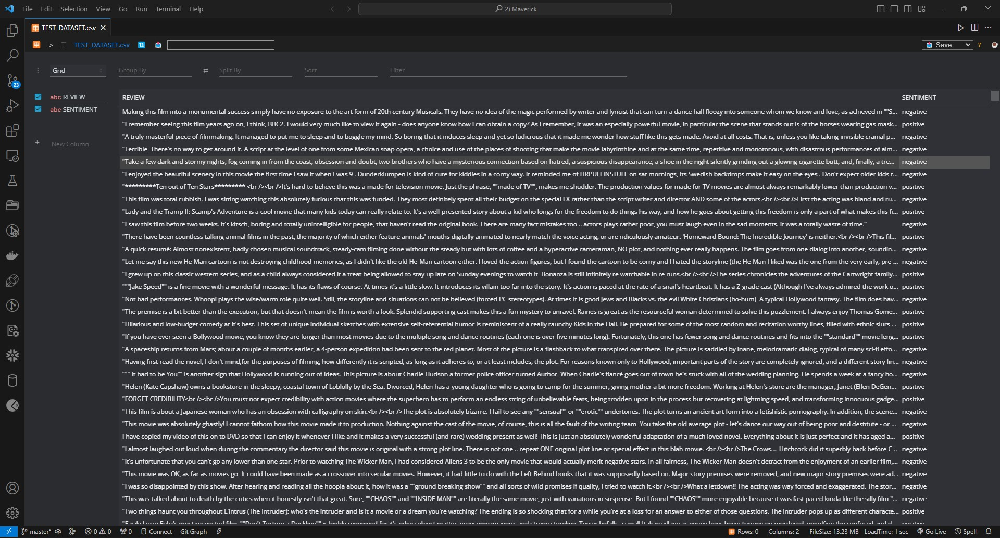

# __Sentiment Analysis with Snowpark ML and NLP__

## Overview

This project implements Natural Language Processing (NLP) and Machine Learning (ML) within Snowflake using Snowpark Python.

<div align="center">
  
</div>

<br>

The origin of the dataset used is from: [kaggle's sentiment analysis](https://www.kaggle.com/c/sentiment-analysis-on-movie-reviews/data)

Overview of the data :

<div align="center">
  
</div>

<br>

Snowpark is a powerful developer framework for Snowflake, enabling data experts to code in their familiar language and execute pipelines, ML workflows, and data applications efficiently and securely.

## Snowpark Integration

Snowpark provides two main approaches:

1. **Dataframe API:** Write efficient queries to collect and enrich the original dataset.

2. **Python Functions and Stored Procedures:** Leverage 3rd party libraries (Anaconda) to create and deploy User-Defined Functions (UDFs) for advanced feature engineering and ML scoring natively into Snowflake.

## Sentiment Analysis Use Case

The project focuses on a Sentiment Analysis use case, utilizing the __IMDB dataset__ comprising over __*10,000 movie reviews*__. Each review has an associated sentiment class in the "SENTIMENT" column. The objective is to process movie reviews and predict whether a review is positive or negative.

The Sentiment Analysis on this dataset is achieved using the __Support Vector Machine Classifier__.

## Key Features

- Connect to the Snowflake database.
- Train and retrain ML models.
- Implement Sentiment Analysis using NLP techniques.

## Requirements

* Git
* Snowflake Account
* Snowpark for Python (3.8) Environment

## Installation

1. Clone the repository. 

    ```bash 
    git clone https://github.com/maxlr8/sentiment_analysis_snowflake_ml.git
    ```

2. Install the required dependencies using 

    ```bash
    pip install -r requirements.txt
    ```

3. Create a new account and set up your Snowflake credentials. Access the credentials from user profile and save it in the [credentials.env](./credentials.env) file.

## Usage

  `Execute this Jupyter Notebook` [Sentiment Analysis](Sentiment_Analysis_using_Snowpark.ipynb)

## Conclusion

This project serves as a robust example of implementing NLP and ML within the Snowflake environment. Feel free to explore and customize the code to suit your specific use cases!

---

**Note:** Make sure to replace placeholder and update instructions as needed.
